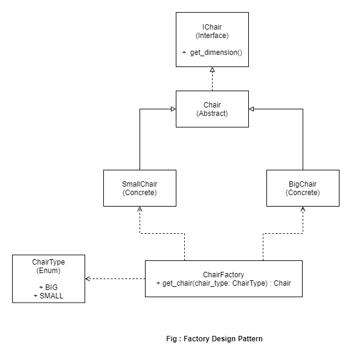

# Design Patterns in Python 3

Will be adding Design Patterns regularly here in this repo.

```Python Version : 3.9```

- [x] Factory
- [x] Builder
- [ ] Adapter
- [ ] Singleton
- [ ] Command
- [ ] Decorator

# UML Diagrams




